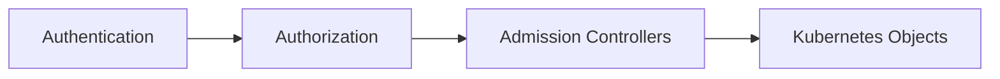

# Kubernetes API Server Security Guidelines

## Overview



## Key Security Areas

1. **Authentication**
    - Use client certificates to authenticate the Kubernetes API Server.
    - Enforce HTTPS for all communication with the Kubernetes API Server.
    - Use service accounts to authenticate pods.
    - Use RBAC to authorize users and service accounts.
2. **Authorization**
    - Use RBAC to authorize users and service accounts.
    - Use Network Policies to restrict access to the Kubernetes API Server.
3. **Encryption**
    - Use TLS to encrypt data in transit.
    - Use encryption at rest to protect data stored in etcd.
4. **Network Security**
    - Use firewalls to restrict access to the Kubernetes API Server.
    - Use Network Policies to restrict access to the Kubernetes API Server.
5. **Role-Based Access Control (RBAC)**
    - Use RBAC to restrict access to the Kubernetes API Server.
6. **Audit Logging**
    - Enable audit logging to track access to the Kubernetes API Server.
    - Use RBAC to restrict access to audit logs.
7. **Hardening**
    - Use Pod Security Policies to restrict access to the Kubernetes API Server.
    - Use Network Policies to restrict access to the Kubernetes API Server.
8. **Monitoring**
    - Use Prometheus and Grafana to monitor the Kubernetes API Server.
    - Use RBAC to restrict access to monitoring data.
9. **Backup and Recovery**
    - Use Velero to backup and restore the Kubernetes API Server.
    - Use RBAC to restrict access to backup and recovery data.

## API Server Authentication

### Authentication Modes

- Static Token Authentication
- Client Certificate Authentication
- OpenID Connect (OIDC) Authentication

### Downsides of Static Token Authentication

- Token are stored in plain text CSV file on the kube-apiserver and referenced in kube-apiserver configuration file.
- Tokens can be read by anyone with access to the kube-apiserver configuration file.
- Tokens cannot be revoked or rotated without restarting the kube-apiserver.

### Downsides of Client Certificate Authentication

- Private Keys are stored in an insecure storage medium on the kube-apiserver.
- Certificates are generally valid for a long period of time. If a certificate is compromised, it can be used to authenticate to the kube-apiserver until it expires.
- Certificates cannot be revoked or rotated without restarting the kube-apiserver.
- Groups are associated with organisation in certificates. If you want to change the group, you need to create a new certificate based on permissions for the new group.

## API Server Authorization

### System Master Group

- The `system:masters` group is a built-in privileged group that has full access to the Kubernetes API Server.
- Members of the `system:masters` group can create, read, update, and delete any Kubernetes object in any namespace.
- Members of the `system:masters` group can still access the Kubernetes API Server even if RBAC is disabled.

### Authorization Modes

| Authorization Mode | Description                                                           |
|--------------------|-----------------------------------------------------------------------|
| AlwaysAllow        | Allows all requests.                                                  |
| AlwaysDeny         | Denies all requests.                                                  |
| RBAC               | Allows you to create  and store policies using the Kubernetes API.    |
| Node               | A special-purpose mode that authorizes API requests made by kubelets. |

## Encryption at Rest

### Encryption Providers

| Provider           | Encryption                  | Strength  | Speed  |
|--------------------|-----------------------------|-----------|--------|
| Identity (default) | No encryption               | N/A       | N/A    |
| aescbc             | AES-CBC with PKCS#7 padding | Strongest | Fast   |
| secretbox          | XSalsa20 and Poly1305       | Strong    | Faster |
| kms                | Envelope Encryption Scheme  | Strongest | Fast   |

> Important Points:
>
> - The default encryption provider is `Identity` which does not encrypt data stored in etcd.
> - When changing the encryption provider, you must re-encrypt all data stored in etcd.

### Encryption Configuration

```yaml
apiVersion: apiserver.config.k8s.io/v1
kind: EncryptionConfiguration
resources:
  - resources:
    - secrets
    providers:
    - aescbc:
        keys:
        - name: key1
          secret: c2VjcmV0
        - name: key2
          secret: YXNkZmFzZGZhc2Rm
    - secretbox:
        keys:
        - name: key1
          secret: c2VjcmV0
        - name: key2
          secret: YXNkZmFzZGZhc2Rm
    - kms:
        name: mykms
        endpoint: http://mykms.example.com
        version: 1.0
        resourceID: myresource
```

## Audit Logging

### Audit Levels

| Level           | Description                                                                                             |
|-----------------|---------------------------------------------------------------------------------------------------------|
| None            | No audit logging is performed.                                                                          |
| Metadata        | Log request metadata (e.g. timestamp, HTTP method, URL, user, etc.) but not request or response bodies. |
| Request         | Log event metadata and request body but not response body.                                              |
| RequestResponse | Log event metadata, request and response bodies.                                                        |

### Audit Policy

```yaml
apiVersion: audit.k8s.io/v1
kind: Policy
rules:
  - level: Metadata
    stages:
      - RequestReceived
      - ResponseComplete
  - level: Request
    stages:
      - RequestReceived
      - ResponseComplete
  - level: RequestResponse
    stages:
      - RequestReceived
      - ResponseComplete
```

[Return to Main Page](../README.md)
